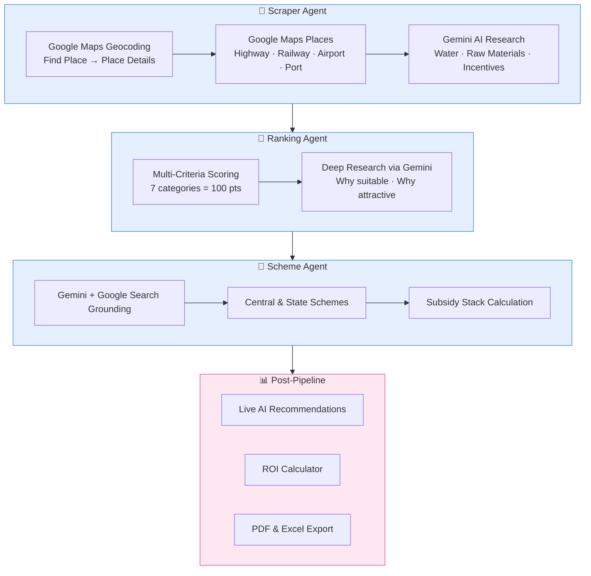

# 🏭 Multi-Agent Industrial Geolocation Engine

> **Built for the GoogleX Hackathon** in collaboration with **DeepStation**

An AI-powered multi-agent platform that helps investors and entrepreneurs identify the **best industrial parks** across India by combining real-time web scraping, Google Maps intelligence, government scheme matching, and Gemini AI deep research — all in a single unified pipeline.

---

## 🏗️ Architecture

```mermaid
flowchart LR
    A["👤 User Input<br/>Sector · State ·<br/>Land · Budget"] --> B["Step 2<br/>Query Engine<br/>Filter 4200+ parks"]
    B --> C["🤖 Scraper Agent<br/>Geocode · Logistics<br/>· Gemini Research"]
    C --> D["💾 MongoDB<br/>Store Enriched Data"]
    D --> E["🤖 Ranking Agent<br/>Score (100pts) ·<br/>Deep AI Research"]
    E --> F["🤖 Scheme Agent<br/>Gemini + Google Search<br/>Central + State Schemes"]
    F --> G["📊 Top 10 Results<br/>Score · Breakdown ·<br/>AI Recommendation"]
    G --> H["📄 PDF / Excel Export<br/>+ ROI Calculator"]

    style C fill:#3b82f6,color:#fff
    style E fill:#3b82f6,color:#fff
    style F fill:#3b82f6,color:#fff
    style H fill:#ec4899,color:#fff
```



### Agent Detail View



---

## ✨ Key Features

| Feature | Description |
|---------|-------------|
| **Multi-Agent Pipeline** | 3 specialized AI agents (Scraper, Ranking, Scheme) orchestrated via SSE streaming |
| **4,200+ Industrial Parks** | Comprehensive dataset covering all Indian states and union territories |
| **Precise Geocoding** | Google Maps Find Place → Place Details → Geocoding API pipeline |
| **Multi-Criteria Scoring** | 7-category weighted scoring engine (Sector, Land, Logistics, Water, Incentives, Plug&Play, Raw Materials) |
| **Deep AI Research** | Per-park Gemini analysis with unique insights and recommendations |
| **Government Schemes** | Gemini + Google Search grounding for real, active central & state schemes |
| **ROI Calculator** | AI-powered investment return projections (break-even, NPV, payback) |
| **PDF/Excel Export** | Professional report generation with Gemini-crafted executive summaries |
| **Live AI Recommendations** | Async per-card Gemini recommendations loaded after results render |
| **Interactive Maps** | Color-coded pins (green/yellow/red by score) with Google Maps integration |

---

## 🛠️ Tech Stack

| Layer | Technology |
|-------|-----------|
| **Backend** | Python 3.11+ · Flask · SSE Streaming |
| **AI Engine** | Google Gemini API (v1beta REST) · `google-genai` SDK |
| **Maps & Location** | Google Maps Platform (Places, Geocoding, Distance Matrix, JS API) |
| **Database** | MongoDB (with in-memory fallback) |
| **Report Generation** | ReportLab (PDF) · openpyxl (Excel) |
| **Frontend** | Vanilla HTML/CSS/JS · Google Maps JavaScript API |

---

## 🚀 Quick Start

### Prerequisites

- Python 3.11+ or Docker
- Google API Key ([AI Studio](https://aistudio.google.com/app/apikey))
- Google Maps API Key ([Cloud Console](https://console.cloud.google.com))

> ⚠️ **Google Maps API** requires these APIs enabled in Cloud Console:
> - Places API (New), Geocoding API, Distance Matrix API, Maps JavaScript API

### Option A: Run Locally (Python)

```bash
# Clone the repository
git clone https://github.com/mandeepsinh-parmar/GoogleX_Hackathon.git
cd GoogleX_Hackathon

# Set up environment
python -m venv .venv
source .venv/bin/activate  # Windows: .venv\Scripts\activate
pip install -r requirements.txt

# Configure keys
cp .env.example .env
# Edit .env with your Google API keys

# Run the app
python app.py
```
Open [http://localhost:5000](http://localhost:5000)

### Option B: Run Locally (Docker)

```bash
docker build -t industrial-finder .
docker run -p 8080:8080 --env-file .env industrial-finder
```
Open [http://localhost:8080](http://localhost:8080)

---

## ☁️ Deployment (Google Cloud Run)

The application is containerized and ready for serverless deployment on Google Cloud Run.

```bash
# 1. Install Google Cloud CLI and authenticate
gcloud auth login
gcloud config set project YOUR_PROJECT_ID

# 2. Deploy directly from source
gcloud run deploy startupadvisor \
  --source . \
  --region asia-south1 \
  --allow-unauthenticated \
  --memory 512Mi \
  --set-env-vars "GOOGLE_API_KEY=YOUR_GEMINI_KEY,GOOGLE_MAPS_API_KEY=YOUR_MAPS_KEY"
```

For detailed deployment instructions, see [DEPLOY.md](DEPLOY.md).

---

## 📁 Project Structure

```
GoogleX_Hackathon/
├── app.py                      # Flask backend — SSE pipeline orchestrator
├── requirements.txt            # Python dependencies
├── .env.example                # Environment variable template
│
├── agents/
│   ├── scraper_agent.py        # 🤖 Agent 1: Geocoding + Logistics + Gemini Research
│   ├── ranking_agent.py        # 🤖 Agent 2: Multi-criteria scoring + Deep Research
│   └── scheme_agent.py         # 🤖 Agent 3: Government scheme matching via Gemini
│
├── tools/
│   ├── location_tools.py       # Park query engine (4200+ parks) + geocoding
│   ├── scheme_tools.py         # Scheme matching + subsidy estimation
│   ├── scoring_tools.py        # Weighted location scoring + state ranking
│   └── export_tools.py         # PDF (ReportLab) + Excel (openpyxl) generation
│
├── db/
│   └── mongo_client.py         # MongoDB client with session management
│
├── data/
│   └── iilb_parks.json         # Dataset: 4,200+ industrial parks across India
│
├── templates/
│   └── index.html              # Frontend: Wizard UI + Google Maps + Results
│
└── docs/
    └── ARCHITECTURE.md         # Detailed architecture documentation
```

---

## 🔌 API Endpoints

| Method | Endpoint | Description |
|--------|----------|-------------|
| `GET` | `/` | Main application UI |
| `POST` | `/api/find-parks` | Step 2: Filter parks by sector, state, land |
| `POST` | `/api/run-pipeline` | Steps 3–7: Full SSE pipeline (scrape → rank → schemes) |
| `GET` | `/api/results/<id>` | Fetch stored results by session ID |
| `POST` | `/api/ai-recommendation` | Generate unique AI recommendation for a park |
| `POST` | `/api/roi-calculator` | AI-powered ROI calculation for a park |
| `POST` | `/api/export/pdf` | Download professional PDF report |
| `POST` | `/api/export/excel` | Download Excel data export |
| `POST` | `/api/chat` | Direct Gemini Q&A |
| `GET` | `/api/health` | Health check |

---

## 🔄 Pipeline Flow

```
User Input → Query 4,200+ Parks → Scraper Agent (Geocode + Logistics + Research)
    → MongoDB Storage → Ranking Agent (Score + Deep Research)
    → Scheme Agent (Central + State Schemes) → Top 10 Results
    → [Async] AI Recommendations → [On-Demand] ROI Calculator → [On-Demand] PDF/Excel Export
```

### Scoring Breakdown (100 points)

| Category | Max Points | How It's Scored |
|----------|-----------|-----------------|
| Sector Match | 20 | Exact match vs. mixed-use |
| Available Land | 20 | Meets or exceeds requirement |
| Logistics | 20 | Highway + Railway + Airport + Port distances |
| Water Supply | 10 | Availability assessment |
| Incentives | 15 | Number and relevance of park incentives |
| Plug & Play | 5 | Ready-to-move infrastructure |
| Raw Materials | 10 | Regional availability |

---

## 🤝 Team

Built with ❤️ for the **GoogleX Hackathon** in collaboration with **DeepStation**.

---

## 📄 License

MIT License — see [LICENSE](LICENSE) for details.
