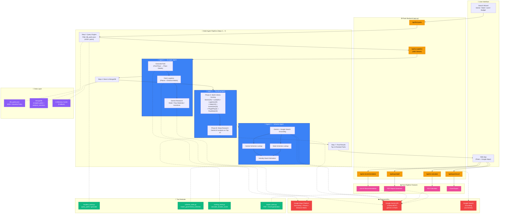

# 🏗️ Architecture — Multi-Agent Industrial Geolocation Engine

## System Overview

The platform uses a **multi-agent architecture** where three specialized AI agents work in sequence, orchestrated by a Flask backend via Server-Sent Events (SSE) for real-time progress streaming to the frontend.

---

## Full System Architecture



---

## Agent Responsibilities

### 🤖 Agent 1 — Scraper Agent (`scraper_agent.py`)

Enriches raw park entries with real-world data:

| Step | API Used | Output |
|------|----------|--------|
| Geocoding | Google Find Place + Place Details | Precise lat/lng, place_id, formatted address |
| Logistics | Google Places + Distance Matrix | Distance to highway, railway, airport, port |
| Research | Gemini AI | Water availability, raw materials, incentives, power supply |

### 🤖 Agent 2 — Ranking Agent (`ranking_agent.py`)

Two-phase intelligence:

- **Phase A — Scoring**: 7-category weighted scoring engine producing a score out of 100
- **Phase B — Deep Research**: Gemini generates per-park analysis (why suitable, why attractive, specific benefits, summary paragraph)

### 🤖 Agent 3 — Scheme Agent (`scheme_agent.py`)

Uses Gemini with **Google Search grounding** to find real, currently active government schemes:

- Central government schemes (PLI, CGTMSE, PM Vishwakarma, etc.)
- State-specific industrial policies
- Subsidy stack calculation (total subsidy, net investment, subsidy percentage)

---

## Post-Pipeline Features

| Feature | Trigger | API |
|---------|---------|-----|
| **AI Recommendation** | Auto-loaded per card (async) | `POST /api/ai-recommendation` |
| **ROI Calculator** | On-demand button click | `POST /api/roi-calculator` |
| **PDF Report** | Export button | `POST /api/export/pdf` |
| **Excel Export** | Export button | `POST /api/export/excel` |

---

## Data Flow

```
iilb_parks.json (4,200+ parks)
    ↓ Filter by sector + state + land
Matched Parks (up to 50)
    ↓ Scraper Agent enriches each park
Enriched Parks
    ↓ Store to MongoDB / in-memory cache
    ↓ Ranking Agent scores all parks
Ranked Parks (sorted by score)
    ↓ Top 10 selected
    ↓ Deep Research on each (Gemini)
    ↓ Scheme Agent fetches govt schemes
Final Results (Top 10 with full data)
    ↓ Streamed to frontend via SSE
    ↓ Async AI recommendations loaded
    ↓ ROI + PDF/Excel available on-demand
```
